# 🛡️ Enterprise DevSecOps & Multi-Cloud GitOps Pipeline

> **Bridging the gap between rapid delivery and uncompromising security.**  
> A fully automated, zero-downtime Continuous Integration and Continuous Deployment (CI/CD) pipeline built to enterprise standards.

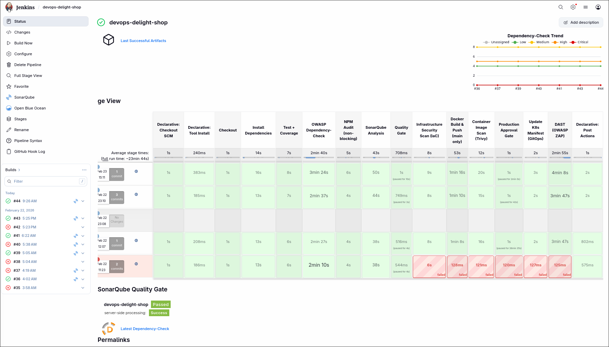

## 📌 The Project Vision
In modern cloud-native environments, pushing code quickly isn't enough; it must be secure by design. The goal of this project was to design a production-grade DevSecOps lifecycle that deploys a modern React Single Page Application (backed by a Supabase BaaS) to a Kubernetes cluster. 

By implementing **Shift-Left security**, **Pull-based GitOps**, and **ChatOps**, this pipeline ensures that vulnerabilities are caught before they reach production, deployments are immutable, and the engineering team is always in the loop.

---

## 🏛️ Architecture & Tech Stack

This project leverages a hybrid-cloud and multi-tool architecture:
* **Cloud Infrastructure:** Azure (Jenkins Master Node) & Oracle Cloud (Production K3s Cluster)
* **CI/CD Orchestration:** Jenkins (Declarative Pipeline with Groovy)
* **Continuous Delivery (GitOps):** ArgoCD
* **Containerization:** Docker & Docker Hub
* **Security & Quality Toolchain:**
  * **SAST (Static Analysis):** SonarQube
  * **SCA (Supply Chain Security):** OWASP Dependency-Check
  * **Container & IaC Scanning:** Trivy (Aqua Security)
  * **DAST (Dynamic Analysis):** OWASP ZAP (Zed Attack Proxy)
* **Observability & ChatOps:** Slack API Webhooks

---

## ⚙️ The Pipeline Lifecycle: Step-by-Step

### Phase 1: Continuous Integration & Code Quality
The moment code is pushed to the repository, Jenkins triggers the build. Before any infrastructure is touched, the code must prove it is clean.
* **SonarQube Quality Gate:** The codebase is analyzed for bugs, code smells, and test coverage. If it fails the enterprise quality gate, the build breaks immediately.
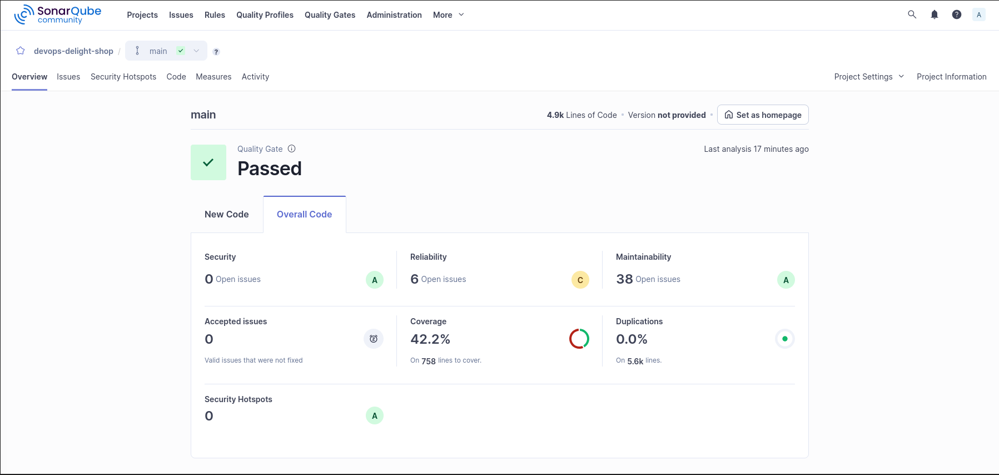

### Phase 2: Shift-Left Security (SCA & IaC)
Security isn't an afterthought; it happens before the image is even built.
* **OWASP Dependency-Check:** Scans all third-party NPM packages against the National Vulnerability Database (NVD) to prevent supply chain attacks.
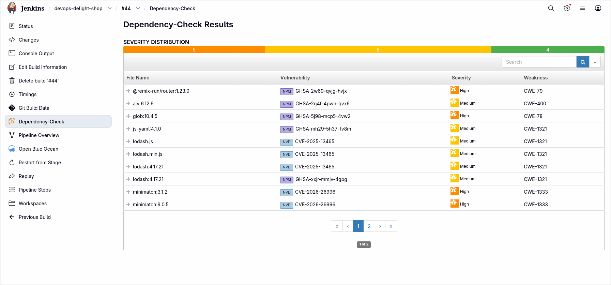
* **Trivy IaC & Container Scan:** Analyzes the `Dockerfile` and `k8s/` deployment manifests to catch misconfigurations. Once built, a temporary Trivy container scans the fresh Docker image for `HIGH` and `CRITICAL` OS-level CVEs.
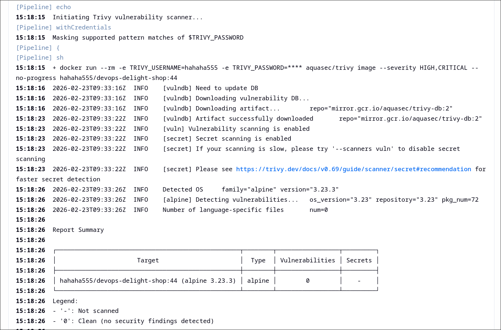

### Phase 3: Secure Containerization
Once the code and configurations pass the gates, the application is packaged.
* **Artifact Registry:** The secure image is tagged dynamically with the Jenkins build number and pushed to Docker Hub.
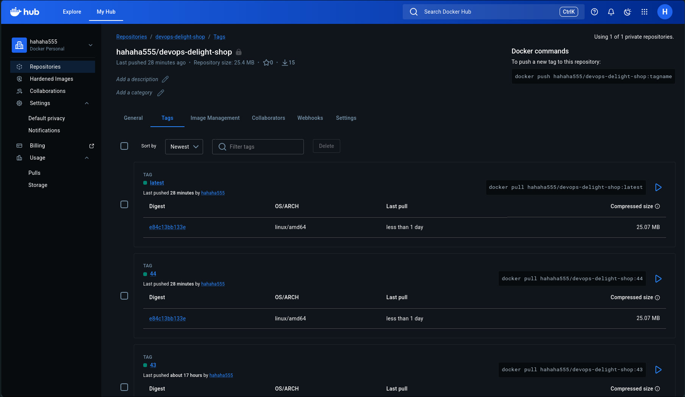

### Phase 4: The GitOps Handoff
This pipeline avoids the anti-pattern of letting the CI server push directly to the Kubernetes cluster. 
* **Automated Manifest Updates:** Jenkins dynamically updates the `deployment.yaml` with the new image tag and pushes the commit back to GitHub using securely injected credentials.
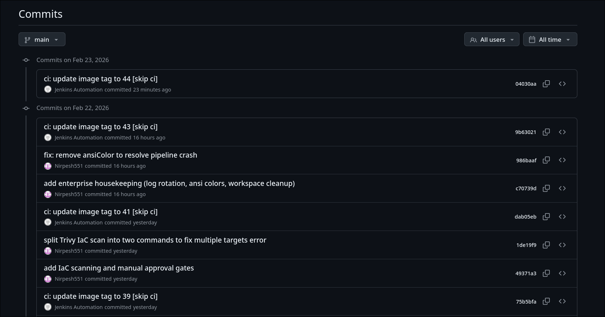

### Phase 5: Human-in-the-Loop & ChatOps
Enterprise environments require a final sanity check before production deployment.
* **Jenkins Blue Ocean Approval:** The pipeline pauses indefinitely, requiring a manual click from an authorized user to proceed.
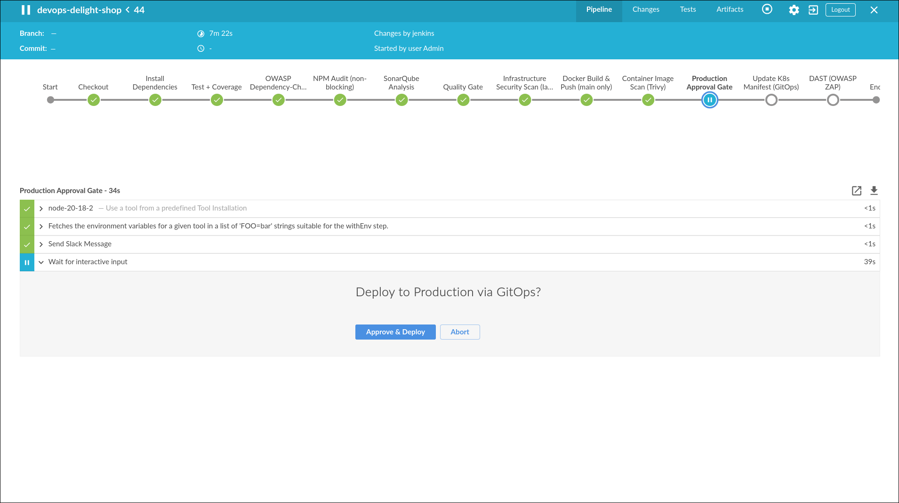
* **Slack Integration:** Real-time webhooks notify the team that a build is waiting for approval, and later confirm its success or failure.
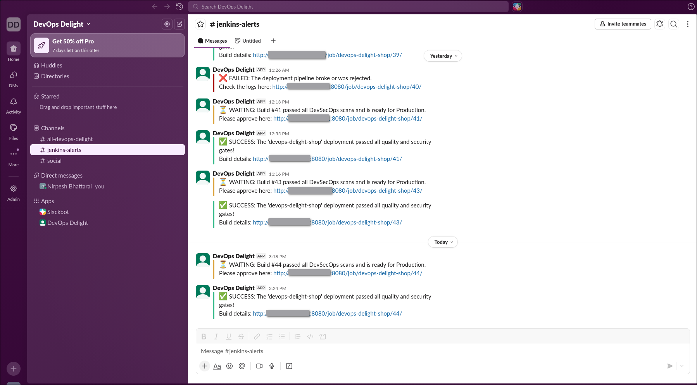

### Phase 6: Continuous Delivery (ArgoCD)
With the code approved and the GitHub repository updated, GitOps takes over.
* **Pull-Based Deployment:** ArgoCD detects the drift in the Git repository and automatically pulls the new manifest into the Oracle Kubernetes cluster, executing a zero-downtime rolling update.
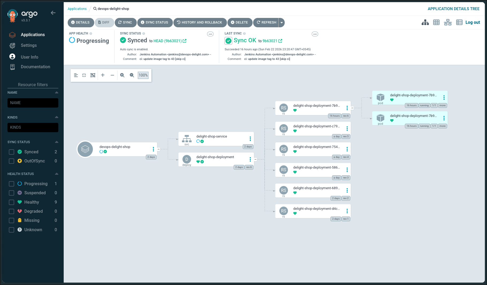
* **Cluster Verification:** The pods are spun up and verified healthy via `kubectl`.
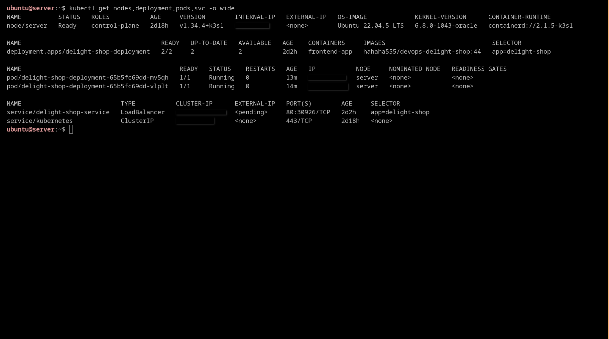

### Phase 7: Dynamic Application Security Testing (DAST)
Even with secure code, runtime misconfigurations can happen.
* **OWASP ZAP:** Once the deployment settles, Jenkins spins up a ZAP container to actively attack the live application URL, checking for vulnerabilities like XSS, SQLi, and missing security headers.
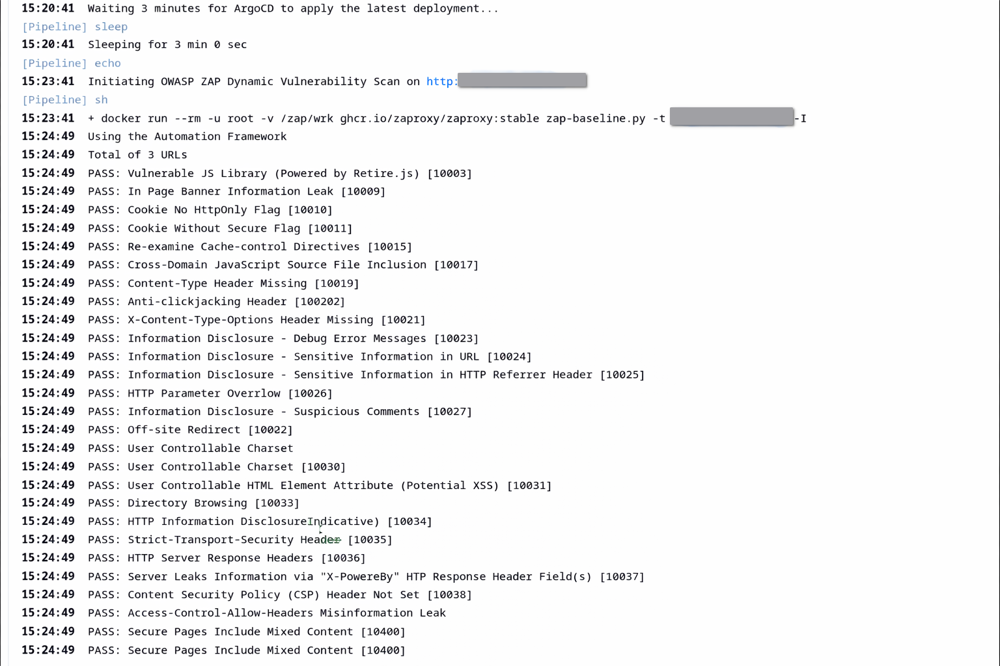

---

## 🌟 The Final Result & Business Value
A highly available, secure, and fully automated application deployment.
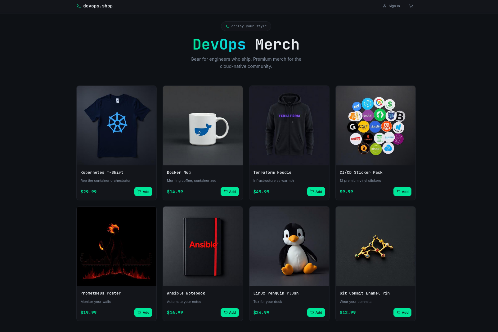

### Key Engineering Decisions
1. **GitOps over CIOps:** By using ArgoCD, the Kubernetes cluster credentials are never exposed to Jenkins. The cluster pulls its own state, ensuring high security and automated drift reconciliation.
2. **Ephemeral Scanning:** Tools like Trivy and ZAP are run as temporary, self-destructing Docker containers (`--rm`), keeping the Jenkins master node clean and dependency-free.
3. **Automated Housekeeping:** The pipeline utilizes Jenkins `buildDiscarder` and workspace cleanup to prevent the Azure VM from running out of disk space over time.
